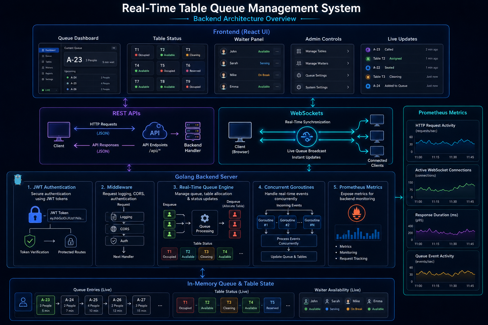
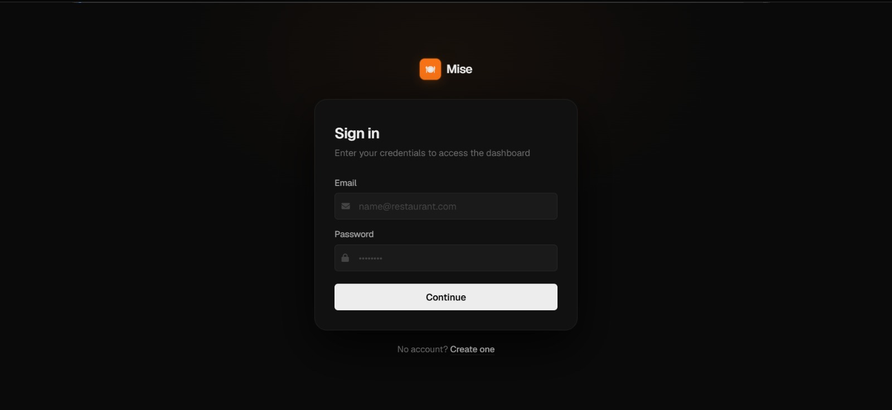
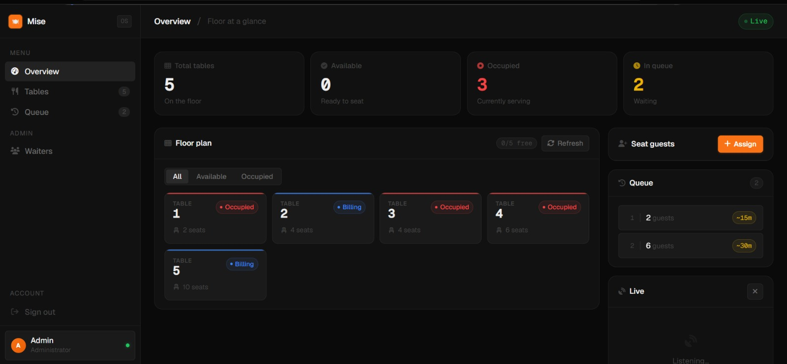
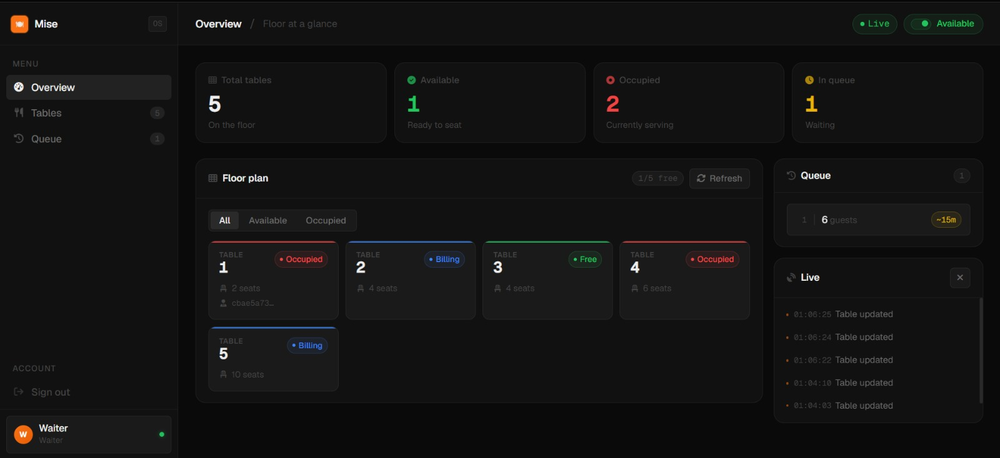
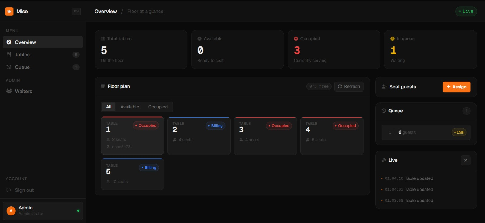
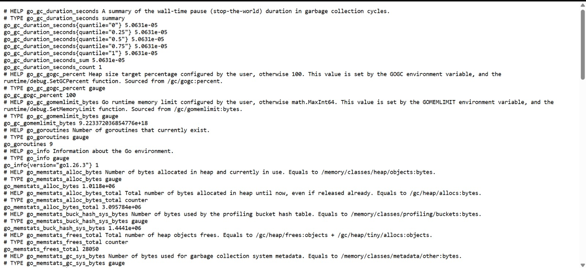

# Real-Time Table Queue Management System

A cloud-deployed real-time Table Queue Management System built using Golang, WebSockets, JWT Authentication, Prometheus Metrics, and modern frontend technologies.

The system enables restaurants and queue-based businesses to manage:
- table availability
- customer queues
- waiter operations
- real-time synchronization
- live queue updates

---

# Live Deployment

## Frontend

https://table-queue-management.vercel.app

## Backend

https://table-queue-management.onrender.com

---

# System Overview

This project provides a real-time queue and table management solution for restaurants and hospitality environments.

The application supports:
- real-time queue synchronization
- live table status updates
- waiter availability management
- secure authentication
- monitoring and observability
- concurrent backend processing

The system uses WebSockets for instant communication between connected clients and the backend server.

---

# Architecture Overview



The architecture consists of:
- Vercel-hosted frontend
- Render-hosted Golang backend
- WebSocket communication layer
- Prometheus metrics exposure
- concurrent in-memory queue processing

---

# Features

## Real-Time Synchronization

- Live queue synchronization using WebSockets
- Instant updates across connected clients
- Dynamic table availability updates
- Real-time waiter activity tracking
- Multi-client event broadcasting

---

## Authentication & Security

- JWT-based authentication
- Protected API routes
- Middleware-based authorization
- Secure request handling
- CORS configuration
- Role-based access flow

---

## Queue & Table Management

- First-Come-First-Serve (FCFS) queue management
- Dynamic table allocation
- Waiter assignment system
- Queue monitoring dashboard
- Live serving and waiting status updates

---

## Backend Engineering Features

- Golang backend server
- REST API architecture
- Concurrent request handling using goroutines
- Middleware-based request flow
- WebSocket communication
- Prometheus monitoring support
- Health check endpoint
- Cloud deployment support

---

# Tech Stack

## Frontend

- HTML5
- CSS3
- JavaScript
- WebSockets
- Vercel Deployment

---

## Backend

- Golang
- Gorilla WebSocket
- JWT Authentication
- REST APIs
- Middleware
- Prometheus Metrics
- Render Deployment

---

## Monitoring

- Prometheus Metrics
- Health Check APIs

---

# Application Screenshots

## Authentication Interface



---

## Dashboard Overview



---

## Queue Management



---

## Waiter Live Synchronization



---

## Prometheus Metrics



---

# API Routes

## Authentication APIs

| Method | Endpoint | Description |
|---|---|---|
| POST | `/signup` | Register user |
| POST | `/login` | Login user |
| POST | `/logout` | Logout user |

---

## Admin APIs

| Method | Endpoint | Description |
|---|---|---|
| GET | `/admin/waiters` | Get waiter list |
| GET | `/admin/stats` | Get waiter statistics |
| POST | `/admin/assign-table` | Assign table |
| DELETE | `/admin/delete-waiter` | Delete waiter |

---

## Waiter APIs

| Method | Endpoint | Description |
|---|---|---|
| POST | `/waiter/status` | Update waiter availability |

---

## Table APIs

| Method | Endpoint | Description |
|---|---|---|
| POST | `/table/status` | Update table status |
| GET | `/tables` | Get all tables |
| GET | `/queue` | Get queue details |

---

## WebSocket

| Endpoint | Description |
|---|---|
| `/ws` | Real-time synchronization |

---

## Monitoring

| Endpoint | Description |
|---|---|
| `/metrics` | Prometheus metrics |
| `/health` | Health check endpoint |

---

# Project Structure


Table-Queue-Management/
│
├── frontend/
│   ├── index.html
│   ├── dashboard.html
│   ├── signup.html
│   ├── script.js
│   └── styles.css
│
├── middleware/
│   └── logger.go
│
├── admin.go
├── auth.go
├── jwt.go
├── websocket.go
├── metrics.go
├── middleware.go
├── health.go
├── main.go
├── go.mod
├── go.sum
└── README.md
```

---

# Local Development Setup

## Clone Repository


git clone https://github.com/Krishnasai-9959/Table-Queue-Management.git

cd Table-Queue-Management


---

## Install Dependencies

go mod tidy


---

## Run Backend


go run .


Backend runs on:


http://localhost:8080

---

## Frontend

Open:


frontend/index.html


OR use VS Code Live Server.

---

# Production Deployment

## Frontend Deployment

- Vercel

## Backend Deployment

- Render

# Docker Support

The project is fully containerized using Docker for consistent development and deployment environments.

---

## Dockerfile

dockerfile
# Build Stage
FROM golang:1.25-alpine AS builder

WORKDIR /app

COPY go.mod go.sum ./
RUN go mod download

COPY . .

RUN go build -o server .

# Production Stage
FROM alpine:latest

WORKDIR /root/

COPY --from=builder /app/server .
COPY --from=builder /app/frontend ./frontend

EXPOSE 8080

CMD ["./server"]

## Build Docker Image

docker build -t table-queue-management .

## Run Docker Container

docker run -p 8080:8080 table-queue-management

## Access Application

http://localhost:8080


## Production Features

- HTTPS enabled
- Secure WebSocket communication (`wss://`)
- Automatic cloud deployment
- Cross-origin support
- Real-time synchronization

---

# Real-Time Workflow


User Action
   ↓
Frontend Request
   ↓
REST API / WebSocket
   ↓
Golang Backend
   ↓
Queue State Updated
   ↓
WebSocket Broadcast
   ↓
All Connected Clients Updated


---

# Monitoring & Observability

The project exposes Prometheus-compatible metrics through:


/metrics


Used for:
- backend monitoring
- request tracking
- queue event observation
- runtime visibility
- performance analysis

---

# Health Check Endpoint

Health endpoint:

/health


Used for:
- deployment verification
- monitoring integration
- server availability checks

---

# Demo Credentials


 Admin  admin@restaurant.com ---> Admin123 


---

# Learning Outcomes

This project demonstrates practical implementation of:

- Golang backend development
- WebSocket communication
- JWT authentication
- REST API design
- Middleware architecture
- Real-time synchronization
- Concurrent backend processing
- Cloud deployment workflows
- Prometheus monitoring
- Frontend-backend integration

---

# Future Improvements

- Docker containerization
- Persistent database integration
- Redis Pub/Sub integration
- Grafana dashboards
- Queue analytics
- CI/CD pipelines
- Kubernetes deployment
- Automated testing

---

# Screenshots Folder Setup

Create a folder named `screenshots` in the project root and add these files:


screenshots/
├── architecture.png
├── login-screen.png
├── dashboard-overview.png
├── queue-management.png
├── waiter-live-sync.png
└── prometheus-metrics.png


---

# Author

Krishna Sai Chakka

## GitHub Repository

https://github.com/Krishnasai-9959/Table-Queue-Management

